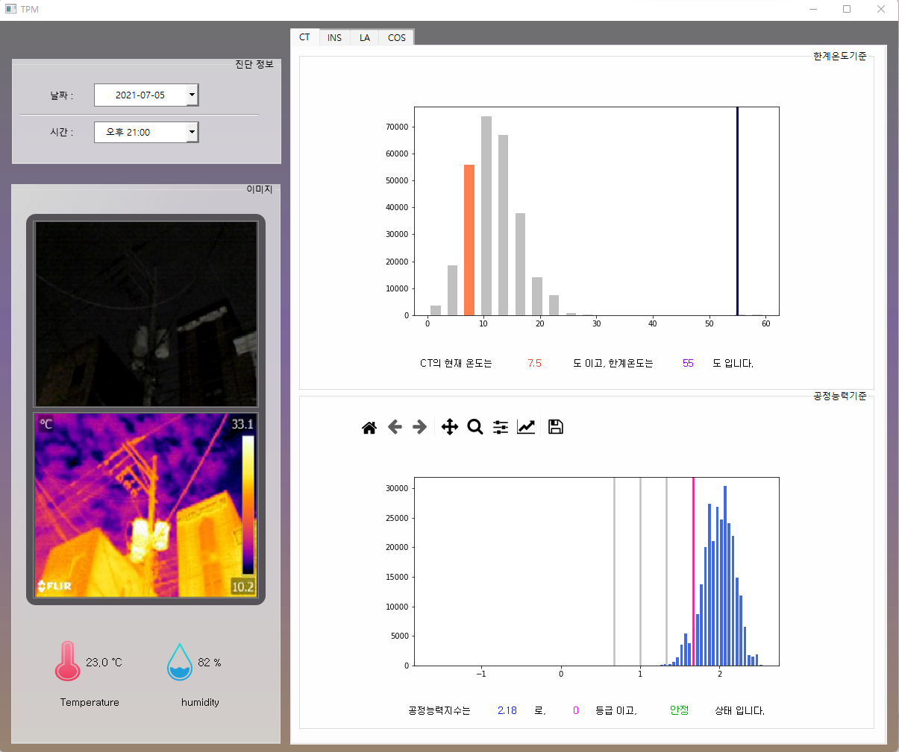
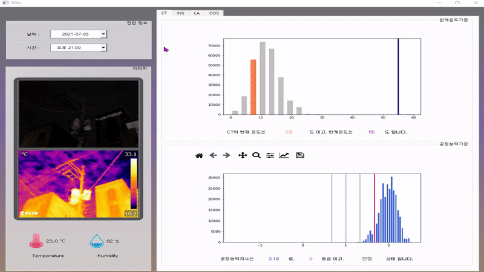

# TPM project
## 전봇대 고장/비고장 예측 진단시스템
* 2021 I-GPS(INHA Group for Problem Solving) project
* 산업경영공학과 종합설계

> **요약**
> 1. 늘어나는 변압기 화재로 피해액은 기하급수적 -> 사전예방 프로세스 개발 필요
> 2. 열화상 이미지 데이터 + 딥러닝 기법 활용한 예방법 제시
> 3. **Train:** 한국전력공사에서 제공받은 16,866장의 열화상 이미지
> 4. **Test:** 인하대학교 후문가의 전봇대를 적외선 카메라로 촬영한 832장의 이미지(21.2~7월)
> 5. 온도, 습도, 기압 데이터: 기상청에서 크롤링
> 6. 객체검출(YOLOv5) 및 온도 값 추출, 온도예측(99% 이상)
> 7. 모니터링 GUI 제작(PyQt)

* 모니터링 시스템 실행 

    `run TPMnew.py`
    
    확인가능한 자료
  - 2021 7월 5일 오후9시
  - 2021년 7월 6일 오전9시
  - 2021년 7월 6일 오후6시
 

* 프로그램 화면
    

* 동작 예시

